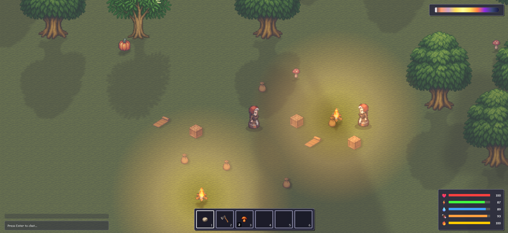

# Vibe Coding Starter Pack: 2D Survival Multiplayer


A lightweight 2D multiplayer survival game starter kit built with modern web technologies. Create interactive survival experiences with persistent player state, real-time multiplayer synchronization, and modular game logic.



## Table of Contents

*   [⚡ Quick Local Setup](#️-quick-local-setup)
*   [🗺️ Roadmap](#️-roadmap)
*   [🛠️ Tech Stack](#️-tech-stack)
*   [🔐 Authentication Setup](#-authentication-setup)
*   [📜 Cursor Rules & Code Maintainability](#-cursor-rules--code-maintainability)
*   [⚙️ Client Configuration](#️-client-configuration)
*   [🌍 World Configuration](#-world-configuration-tile-size--map-dimensions)
*   [📁 Project Structure](#-project-structure)
*   [🚀 Running the Project Locally](#-running-the-project-locally)
*   [🔧 Troubleshooting Local Setup](#-troubleshooting-local-setup)
*   [🔄 Development Workflow](#-development-workflow)
*   [🤝 Contributing](#-contributing)
*   [📜 License](#-license)

## ⚡ Quick Local Setup

For experienced users familiar with Node.js, Rust, and SpacetimeDB. See detailed sections below for troubleshooting or authentication specifics.

**0. Install SpacetimeDB CLI:**
Follow the instructions for your OS: [https://spacetimedb.com/install](https://spacetimedb.com/install)
(e.g., `curl -sSf https://install.spacetimedb.com | sh` on macOS/Linux)

**1. Clone & Install Client Deps:**
```bash
git clone https://github.com/thinktidevibes/2D-Survival-Multiplayer-Game.git
cd 2D-Survival-Multiplayer-Game
npm install
```

**2. Setup & Run Auth Server (Terminal 1):**
```bash
# Ensure OpenSSL is installed (https://www.openssl.org/source/)

# From the project root directory, create a 'keys' directory:
mkdir keys

# Generate RSA private and public key files inside the 'keys' directory:
openssl genpkey -algorithm RSA -out keys/private.pem -pkeyopt rsa_keygen_bits:2048
openssl rsa -pubout -in keys/private.pem -out keys/public.pem

# Navigate to the auth server directory and run it:
cd auth-server-openauth/
npm install
npm start
# Keep this terminal running (Auth Server on http://localhost:4001)
```

**3. Run SpacetimeDB Server (Terminal 2):**
```bash
# In project root directory
spacetime start
# Keep this terminal running (SpacetimeDB Server)
```

**4. Publish Server & Generate Bindings (Terminal 3):**
```bash
cd server/
# Optional: Clean previous DB state if needed
# spacetime delete vibe-survival-game
spacetime publish vibe-survival-game
spacetime spacetime generate --lang typescript --out-dir ../client/src/generated --project-path .
cd ..
```

**5. Run Client Dev Server (Terminal 3 or 4):**
```bash
# In project root directory
npm run dev
# Access game at http://localhost:3008 (or similar)
```
*   **For Multiplayer Testing:** Open a **new terminal** in the project root and run `npm run dev` again. The second client will likely open on a different port (e.g., 3009). Open this URL in a separate browser tab or window.

**Updating Server Code:**
*   **Logic Change Only:** `cd server && spacetime publish vibe-survival-game`
*   **Schema Change (Tables/Reducers):**
    1.  `(Optional but Recommended)` `spacetime delete vibe-survival-game` (Run *before* publish to prevent schema conflicts).
    2.  `cd server`
    3.  `spacetime publish vibe-survival-game`
    4.  `spacetime generate --lang typescript --out-dir ../client/src/generated --project-path .`
    5.  `cd ..`

## 🗺️ Roadmap

**Completed (✅):**
*   Real-time Multiplayer: Basic player movement synchronization
*   Environment Systems: Day/night cycle, Full moon nights
*   Survival Mechanics: Basic resource harvesting (wood/stone/mushrooms)
*   Resource Respawning: Trees, Stones, Mushrooms
*   Survival Systems: Health, Hunger, Thirst, Warmth, Death/Respawn
*   World Discovery: Minimap
*   Hotbar/Basic UI: Item selection, basic layout
*   Inventory Management: Moving, swapping, stacking, stack splitting
*   Item Equipping: Tools/Weapons (Hotbar), Armor (Slots)
*   Placeables: Campfire (Multi-slot placement & interaction)
*   Crafting System: Item recipes
*   Storage Containers (Chests)
*   Looting Mechanics (Containers)
*   Authentication/Account System

**In Progress (🚧):**
*   Performance Optimizations: Viewport culling, collision system improvements
*   Code Refactoring: Breaking down large modules into smaller, more maintainable components
*   Scaling Improvements: Optimizing data structures and algorithms for larger player counts
*   Entity Component System: Laying groundwork for more efficient entity management
*   Network Optimization: Reducing bandwidth usage through delta updates and prioritization

**Planned (📓):** 
*   **Core Systems & World:**
    *   World Generation: Procedural generation, biomes, monuments
    *   Terrain Autotiling: Edge detection, Wang tiles, seamless transitions between biomes
    *   Advanced AI: Enemy behaviors, pathfinding
    *   Team/Social Features
*   **Gameplay Loops & Interaction:**
    *   Construction System: Base building (walls, floors, etc.)
    *   Farming System: Planting, growing, harvesting crops
    *   Cooking System: Preparing food using campfire
*   **Combat & Items:**
    *   Combat Improvements: New weapon types (melee, hybrid, ranged), improved hit detection, PvP balancing
    *   Tool/Weapon Durability
    *   More Item Variety: Expanded tools, weapons, armor, resources, consumables

## 🛠️ Tech Stack

| Layer       | Technologies                |
|-------------|----------------------------|
| Frontend    | React 19, Vite 6, TypeScript |
| Multiplayer | SpacetimeDB                |
| Backend     | Rust (WebAssembly)         |
| Development | Node.js 22+                |

## 🔐 Authentication Setup

This project implements user authentication using a custom Node.js authentication server built with OpenAuthJS and Hono, bridged to SpacetimeDB via standard OpenID Connect (OIDC) JWTs.

**Approach:**

1.  **Client:** Initiates an OIDC Authorization Code Flow with PKCE, manually constructing the `/authorize` URL for the custom auth server and specifying `acr_values=pwd` to request the password flow.
2.  **Auth Server (`auth-server-openauth/`):** A Node.js/Hono server that:
    *   Intercepts the `/authorize` request.
    *   If `acr_values=pwd`, redirects the user to custom HTML login/registration forms, forwarding OIDC parameters (`client_id`, `redirect_uri`, `state`, `code_challenge`, etc.).
    *   Handles POST submissions from these forms, verifying user credentials against a local user store (`data/users.json`).
    *   On successful login/registration, generates a one-time authorization `code` and stores it along with the user ID and PKCE challenge.
    *   Redirects the user back to the client's specified `redirect_uri` with the `code` and `state`.
3.  **Client:** Receives the redirect at its `/callback` URI, extracts the `code`.
4.  **Client:** Makes a `fetch` POST request to the auth server's custom `/token` endpoint, sending the `code`, PKCE `code_verifier`, `client_id`, and `redirect_uri`.
5.  **Auth Server (`/token`):**
    *   Receives the code exchange request.
    *   Looks up the code, retrieves the associated user ID and PKCE challenge.
    *   Verifies the `code_verifier` against the stored `code_challenge`.
    *   If valid, mints a new JWT `id_token` and `access_token`, signed using a **private RSA key** (RS256 algorithm).
    *   Returns the tokens to the client.
6.  **Client:** Receives the tokens, stores the `id_token` (used as the `spacetimeToken`).
7.  **Client:** Connects to the main SpacetimeDB game server (`server/`) using the `id_token`.
8.  **SpacetimeDB Server (`server/`):**
    *   Configured with the `issuer` URL of the auth server.
    *   Fetches the OIDC discovery document (`/.well-known/openid-configuration`) and then the public keys (`/.well-known/jwks.json`) from the auth server.
    *   Verifies the `id_token`'s signature using the fetched public key and validates the `iss` (issuer) and `aud` (audience) claims.
    *   Grants the connection access based on the identity (`sub` claim) in the validated token.

This approach uses standard OIDC practices with asymmetric key signing (RS256), allowing SpacetimeDB to securely verify tokens without needing a shared secret.

### Running Authentication Locally

To get authentication working during local development, follow these steps:

1.  **Generate RSA Keys:** You need an RSA key pair for signing and verifying tokens. Use OpenSSL:
    *   Open a terminal in the **project root** directory.
    *   Run the following commands:
        ```bash
        # Create a directory for keys if it doesn't exist
        mkdir keys
        # Generate a 2048-bit RSA private key
        openssl genpkey -algorithm RSA -out keys/private.pem -pkeyopt rsa_keygen_bits:2048
        # Extract the public key from the private key
        openssl rsa -pubout -in keys/private.pem -out keys/public.pem
        ```
    *   This creates `keys/private.pem` (keep secret, used by auth server) and `keys/public.pem` (used for verification).
    *   **Important:** The `.gitignore` file is configured to prevent these keys from being committed to Git.

2.  **Configure Auth Server (`auth-server-openauth/`):**
    *   No `.env` file is strictly required for basic local operation, as defaults are set in `index.ts`.
    *   The server automatically loads `keys/private.pem` and `keys/public.pem` for signing tokens and serving the JWKS endpoint.
    *   It manages user data in `data/users.json` (which will be created automatically if it doesn't exist). The `.gitignore` also prevents this file from being committed.

3.  **Run Auth Server:**
    *   Open a terminal in the `auth-server-openauth/` directory.
    *   Run `npm install` if you haven't already.
    *   Run `npm start`.
    *   Keep this terminal running. You should see `🚀 Auth server → http://localhost:4001`. Logs for authentication steps will appear here.

4.  **Configure SpacetimeDB Server (`server/data/config.toml`):**
    *   Ensure the `server/data/config.toml` file has the following `[auth]` configuration to trust your auth server:
        ```toml
        [auth]
        [[identity_provider]]
        type     = "oidc"
        issuer   = "http://localhost:4001"       # URL of our OpenAuth server
        jwks_uri = "http://localhost:4001/.well-known/jwks.json" # Explicitly point to the JWKS endpoint
        audience = "vibe-survival-game-client" # Must match 'aud' claim in tokens
        ```

5.  **Run Main SpacetimeDB Server (`server/`):**
    *   Open a **separate terminal**.
    *   Run `spacetime start`.
    *   Keep this terminal running.

6.  **Client Configuration:** No changes are needed in the client code. `AuthContext.tsx` is configured to use the auth server at `http://localhost:4001`.

7.  **Run Client:**
    *   Open a terminal in the project **root** directory.
    *   Run `npm run dev`.

Now, when you sign in via the client's login screen, the full authentication flow using your custom OpenAuthJS server and RS256 keys should execute.

### Production Deployment

*   **Auth Server:** Deploy the `auth-server-openauth` Node.js application to a hosting provider. Ensure the `keys/private.pem` and `keys/public.pem` files are securely deployed alongside the application (or manage keys via environment variables/secrets management if your host supports it). Ensure it's served over HTTPS.
*   **Client:** Update `AUTH_SERVER_URL` in `client/src/contexts/AuthContext.tsx` to point to your *deployed* auth server URL (using HTTPS).
*   **SpacetimeDB:** Configure your SpacetimeDB Maincloud/Enterprise instance with the *production* `issuer` and `jwks_uri` of your deployed auth server, and the correct `audience`.

### Limitations & Future Improvements

*   **Basic Forms:** The login/register forms served by the auth server are very basic HTML. They could be enhanced or replaced with a proper frontend framework if desired.
*   **Error Handling:** Error handling in the manual auth routes could be more user-friendly.
*   **No Refresh Token Handling:** This setup doesn't implement refresh tokens. If the `id_token` expires, the user would need to log in again.

## 📜 Cursor Rules & Code Maintainability

### Cursor Rules (`.cursor/rules/`)

This project utilizes [Cursor](https://cursor.sh/)'s AI features, including **Rules**, to aid development. Rules are markdown files (`.mdc`) that provide context and guidelines to the AI assistant.
*   `guide.mdc`: Contains general architectural guidelines, technology choices, and development workflow information.
*   `resources.mdc`: Outlines the specific steps for adding new resources or gatherable nodes consistently.

As the project grows, more specific rules will be added for core features (e.g., crafting, building, combat) to ensure the AI can provide consistent and relevant assistance.

### Code Maintainability

While the project is still evolving, a key goal is maintainability. As features are added, we aim to:
*   Keep individual file sizes manageable (ideally under ~600 lines where practical).
*   Refactor logic into reusable helper functions and potentially dedicated modules (like the planned `inventory_logic.rs`).
*   Utilize abstraction to avoid code duplication, especially for common interactions like container management.

## ⚙️ Client Configuration

### Game Parameters (`client/src/config/gameConfig.ts`)

This file centralizes client-side values needed primarily for rendering the game world. 
The server uses its own authoritative values for game logic. Modifying these client values only affects local visuals.

*   `tileSize`: Visual pixel size for grid tiles.
*   `worldWidth`, `worldHeight`: Visual dimensions of the world grid (in tiles).
*   `spriteWidth`, `spriteHeight`: Pixel dimensions of a single sprite frame for rendering.

### SpacetimeDB Connection (`client/src/App.tsx`)

To connect the client to your SpacetimeDB instance, configure the following constants near the top of `client/src/App.tsx`:

```typescript
const SPACETIME_DB_ADDRESS = 'ws://localhost:3000';
const SPACETIME_DB_NAME = 'vibe-survival-game';
```

*   **For Local Development:** Use the default values (`ws://localhost:3000` and your module name).
*   **For Maincloud Deployment:** Replace `SPACETIME_DB_ADDRESS` with your Maincloud WebSocket URI (e.g., `wss://maincloud.spacetimedb.net`) and `SPACETIME_DB_NAME` with your Maincloud database name (e.g., `your-identity/your-database-name`).

## 🌍 World Configuration (Tile Size & Map Dimensions)

Changing the tile size or the overall world dimensions requires modifications in **both** the client and server code to ensure consistency between rendering, collision detection, and game logic.

1.  **Client (`client/src/config/gameConfig.ts`):**
    *   Modify the `TILE_SIZE` constant at the top of the file.
    *   Modify the `worldWidth` and `worldHeight` properties within the exported `gameConfig` object (these define dimensions in *tiles*).
    *   Other values like `minimapGridCellDiagonalTiles` might also need tuning depending on the new world size.

2.  **Server (`server/src/lib.rs`):**
    *   Modify the `TILE_SIZE_PX` constant.
    *   Modify the `WORLD_WIDTH_TILES` constant.
    *   Modify the `WORLD_HEIGHT_TILES` constant.

**Important:** Ensure the `TILE_SIZE` / `TILE_SIZE_PX` and the `worldWidth`/`Height` / `WORLD_WIDTH`/`HEIGHT_TILES` values are kept consistent between the client and server configuration files.

After making server-side changes, remember to **re-publish** the module:

```bash
# From the server/ directory
spacetime publish vibe-survival-game
# No need to regenerate client bindings for changing only these constants
```

## 📁 Project Structure

```
vibe-coding-starter-pack-2d-survival/
├── .cursor/        # Cursor AI configuration
│   └── rules/      # *.mdc rule files for AI context
├── client/         # React frontend (UI, rendering, input)
│   ├── public/     # Static files (index.html, favicons)
│   ├── src/
│   │   ├── assets/ # Sprites, textures, sounds
│   │   ├── components/ # React components (UI, Canvas)
│   │   ├── config/     # Client-side game configuration
│   │   ├── generated/  # Auto-generated SpacetimeDB bindings
│   │   ├── hooks/      # Custom React hooks
│   │   ├── types/      # Shared TypeScript types (e.g., drag/drop)
│   │   └── utils/      # Helper functions (rendering, logic)
│   └── package.json
├── server/         # SpacetimeDB server logic (Rust)
│   ├── src/        # Server code (lib.rs, modules)
│   └── Cargo.toml
├── github.png      # Banner image
├── preview.png     # Gameplay preview image
├── README.md
└── LICENSE
```

## 🚀 Running the Project Locally

This guide assumes you have installed the prerequisites: Node.js v22+, Rust, and the SpacetimeDB CLI.

1.  **Clone the Repository:**
    ```bash
    git clone https://github.com/thinktidevibes/2D-Survival-Multiplayer-Game.git
    cd 2D-Survival-Multiplayer-Game
    ```

2.  **Install Client Dependencies:**
    ```bash
    # From the project root directory
    npm install
    ```

3.  **Start Local SpacetimeDB Server:**
    Open a **separate terminal** window and run:
    ```bash
    spacetime start
    ```
    Keep this terminal running in the background. It hosts your local game database.

4.  **Build, Publish Server Module & Generate Client Bindings:**
    Open **another terminal** window, navigate to the `server` directory, and run these commands:
    ```bash
    cd server
    spacetime publish vibe-survival-game
    spacetime generate --lang typescript --out-dir ../client/src/generated
    ```
    *   **Note:** You need to re-run these two commands *every time* you change the server schema (e.g., modify tables or reducers in `server/src/lib.rs` or other `.rs` files).

5.  **Run the Client:**
    In the **same terminal** as step 4 (or a new one, just make sure you are in the project root directory `2D-Survival-Multiplayer-Game`), run:
    ```bash
    npm run dev
    ```

6.  **Access the Game:**
    Open your browser and navigate to the local address provided by Vite (usually `http://localhost:5173` or similar).

## 🔧 Troubleshooting Local Setup

*   **`Cannot find module './generated'` error in client:**
    *   Ensure you ran `spacetime generate --lang typescript --out-dir ../client/src/generated --project-path .` from the `server` directory *after* the last `spacetime publish` was **successful**. Check the publish output for errors.
    *   Make sure the `client/src/generated` folder was actually created and contains `.ts` files, including `index.ts`.
    *   Restart the Vite dev server (`npm run dev`). Sometimes Vite needs a restart after significant file changes.
*   **Client connects but game doesn't load / players don't appear:**
    *   Check the browser console (F12) for JavaScript errors (e.g., subscription failures, rendering issues).
    *   Check the terminal running `spacetime start` for server-side Rust errors (e.g., reducer panics, assertion failures).
*   **Old players/data still appearing after disconnect/refresh:**
    *   Verify the `identity_disconnected` logic in `server/src/lib.rs` is correctly deleting the player, inventory, and equipment.
    *   For a guaranteed clean slate during development, delete and recreate the local database:
        ```bash
        # Stop spacetime start (Ctrl+C in its terminal)
        spacetime delete vibe-survival-game # Run from any directory
        spacetime start # Restart the server
        # Then re-publish and re-generate (Step 4 above)
        ```
*   **`spacetime publish` tries to publish to Maincloud instead of local:**
    *   Ensure you are logged out: `spacetime logout`.
    *   Ensure the `spacetime start` server is running *before* you publish.
    *   Check your SpacetimeDB config file (`%LOCALAPPDATA%/SpacetimeDB/config/cli.toml` on Windows, `~/.local/share/spacetime/config/cli.toml` on Linux/macOS) and make sure `default_server` is set to `local` or commented out.

## 🔄 Development Workflow

1.  **Server Development (`server/src`)**:
    *   Modify Rust code (add features, fix bugs).
    *   **If schema changes (tables, reducer signatures):**
        1.  Run `spacetime publish vibe-survival-game` (from `server/`).
        2.  Run `spacetime generate --lang typescript --out-dir ../client/src/generated --project-path .` (from `server/`).
    *   **If only logic changes (no schema impact):**
        1.  Run `spacetime publish vibe-survival-game` (from `server/`). (Generate is not strictly needed but doesn't hurt).
2.  **Client Development (`client/src`)**:
    *   Modify React/TypeScript code.
    *   The Vite dev server (`npm run dev`) usually provides Hot Module Replacement (HMR) for fast updates. If things seem broken after large changes, try restarting the dev server.

## 🤝 Contributing

We welcome contributions to this project! To contribute, please follow the standard GitHub Fork & Pull Request workflow:

1.  **Fork the Repository**: Click the 'Fork' button on the top right of the main repository page (`thinktidevibes/2D-Survival-Multiplayer-Game`) to create your personal copy under your GitHub account.
2.  **Clone Your Fork**: Clone *your forked repository* to your local machine:
    ```bash
    git clone https://github.com/YOUR_USERNAME/2D-Survival-Multiplayer-Game.git
    cd 2D-Survival-Multiplayer-Game
    ```
    (Replace `YOUR_USERNAME` with your actual GitHub username).
3.  **Create a Branch**: Create a new branch for your feature or fix:
    ```bash
    git checkout -b feature/your-feature-name
    ```
4.  **Implement Your Changes**: Make your code changes, following project style guidelines.
5.  **Test Thoroughly**: Ensure your changes work as expected and don't break existing functionality.
6.  **Commit Your Changes**: Commit your work with a clear message:
    ```bash
    git commit -m "feat: Add awesome new feature"
    ```
7.  **Push Your Branch**: Push your changes *to your fork*:
    ```bash
    git push origin feature/your-feature-name
    ```
8.  **Open a Pull Request**: Go back to the *original* repository (`thinktidevibes/2D-Survival-Multiplayer-Game`) on GitHub. You should see a prompt to create a Pull Request from your recently pushed branch. Click it, or navigate to the "Pull Requests" tab and click "New Pull Request".
9.  **Configure the PR**: Ensure the base repository is `thinktidevibes/2D-Survival-Multiplayer-Game` and the base branch is typically `main` (or the relevant development branch). Ensure the head repository is your fork and the compare branch is your feature branch (`feature/your-feature-name`).
10. **Describe Your Changes**: Provide a clear title and description for your Pull Request, explaining the changes and their purpose.

Whether you're interested in adding new gameplay mechanics, improving existing systems, or enhancing the codebase, your contributions are valuable to making this starter pack even better!

For questions or discussions about potential contributions, feel free to open an issue first to discuss your ideas.

## 📜 License

This project is licensed under the MIT License - see the LICENSE file for details.

---

Created by [ThinkTide](https://x.com/ThinkTide)
